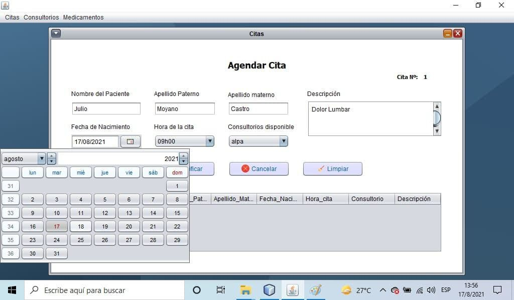
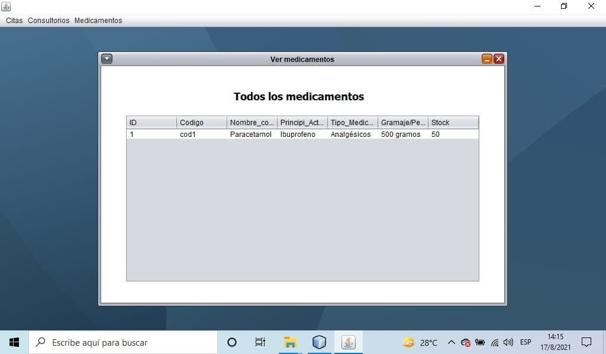

# Sistema-Consultorio-Clinico-Espe
Proyecto de la materia POO, especialidad Ingenieria en las TICs de la Universidad de las Fuerzas Armadas ESPE.

## Problemas Planteado
El hospital regional del Valle está analizando su sistema para gestionar citas, consultorios y medicamentos 
debido a que la capacidad hospitalaria se ha visto afectada en los últimos meses y desean estar prevenidos para futuros incidentes. 
Por lo que el departamento de informática del hospital analizo la solicitud de losdirectivos, identificando los requerimientos del sistema.

## Descripcion
La siguiente imagen podemos ver el panel donde podemos agrendar la cita medica de un paciente

En esta imagine podemos agregar los medicamentos a nuestro sistema clinico

